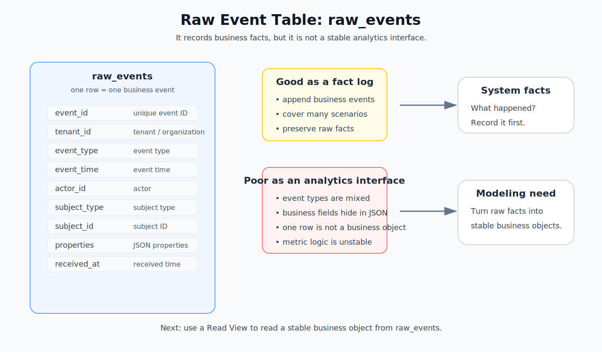
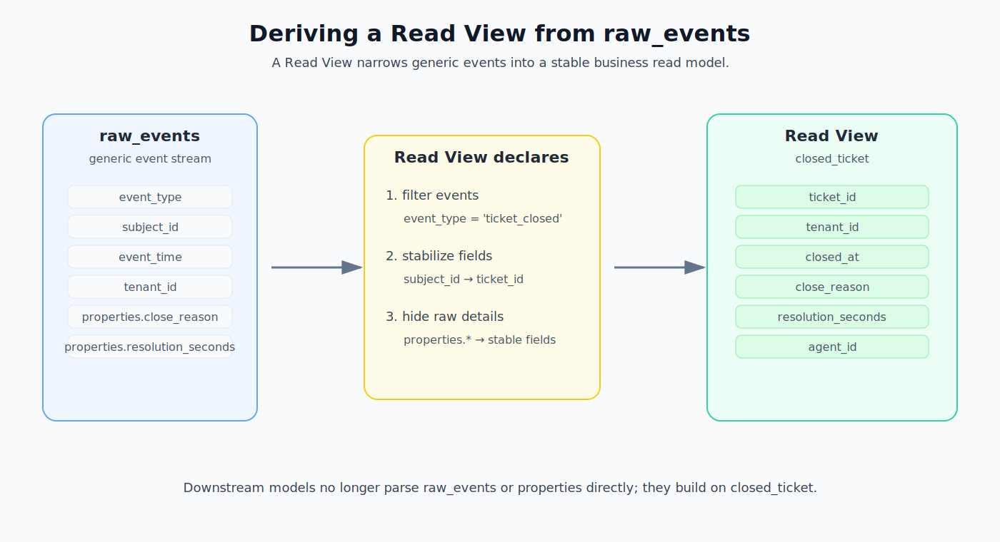
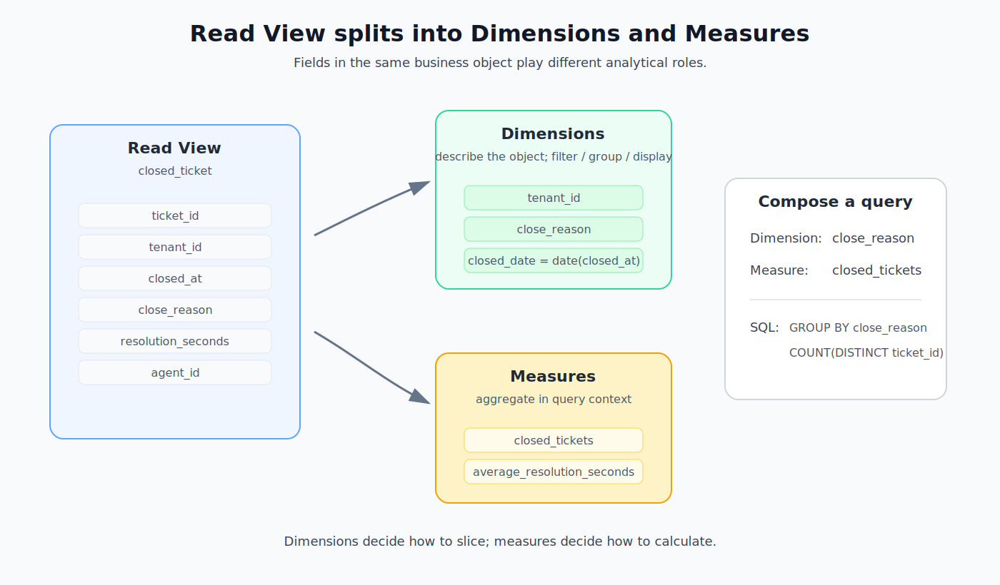
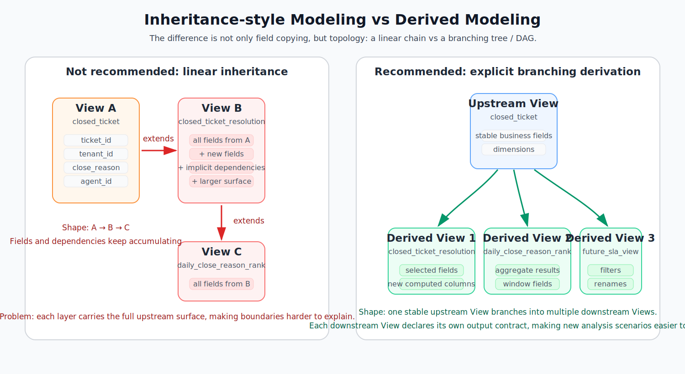
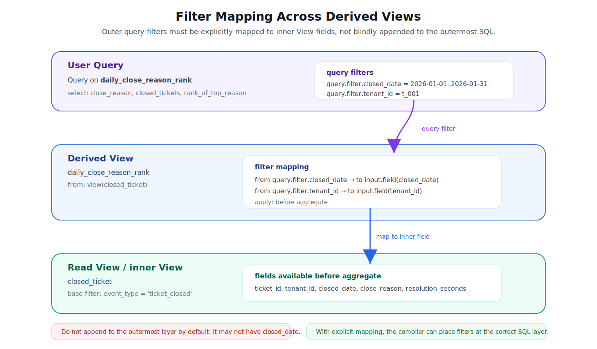
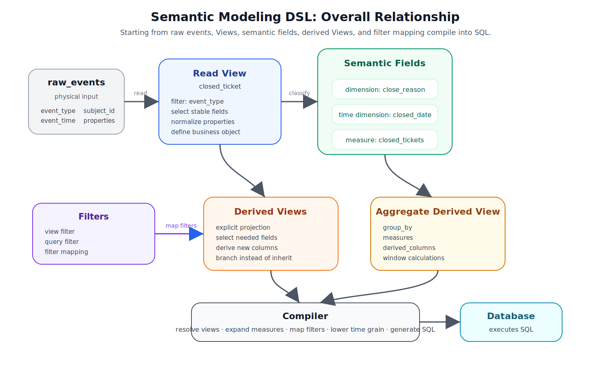

# Designing a Semantic Modeling DSL

Many semantic layer designs start with an implicit assumption: the data warehouse already has clean detail tables, such as orders, tickets, payments, or users. Once the data has already been shaped into those business-facing tables, defining fields, metrics, and query entry points becomes a much clearer problem.

But what if we start with only one raw event table?

A raw event table is like an operational ledger. It records many things that happened in the business: an order was created, a payment succeeded, a support ticket was closed, a refund was requested. It stores facts, but it is not a stable interface for analysis.

This article starts from that lower-level problem: how can we progressively turn a raw event table into a stable analytical modeling DSL?

> The core problem is not “how do we give one table more field names?” It is: how do we turn raw facts into stable business objects, so downstream analysis no longer needs to rediscover the raw event structure every time?

## 1. Starting from a Raw Event Table

We start with a table that records every business action, not with a curated detail table that already came from a warehouse modeling process.

A raw event table can be understood as an operational event ledger.

Whenever something happens in a business system, one row is appended to this table. The table is not designed for one specific report or analytical subject. It is a lower-level, more generic event recording interface.

For example, we can define a generic raw event table named `raw_events`:

| Field | Meaning |
| --- | --- |
| `event_id` | Unique event ID |
| `tenant_id` | Tenant or organization ID |
| `event_type` | Event type, such as `order_created`, `ticket_closed`, `payment_succeeded` |
| `event_time` | When the event happened |
| `actor_id` | User or system that triggered the event |
| `subject_type` | Type of object being acted on, such as `order`, `ticket`, or `payment` |
| `subject_id` | ID of the object being acted on |
| `properties` | Semi-structured event payload, usually JSON |
| `received_at` | When the system received the event |

The diagram below shows where `raw_events` sits: it is the physical input for modeling, but it is not the interface we want to expose to analytics users for the long term.



This table looks generic. That is useful for ingestion, but it also makes the table unsuitable as an analytical interface.

For example, the same `raw_events` table may contain `order_created`, `order_paid`, `ticket_opened`, `ticket_closed`, `payment_succeeded`, and `refund_requested` events at the same time.

It is good as a raw fact log: whatever happened in the business can be recorded there first. But if we hand this table directly to analysts, many hidden rules leak into every query.

| Problem | What it means in practice |
| --- | --- |
| Event types are mixed | Users must know which `event_type` to filter |
| Field meaning is unstable | The same `subject_id` may represent an order, ticket, or payment depending on event type |
| Business fields are buried | Close reasons, payment channels, refund reasons, and other fields may live inside `properties` |
| Time semantics are ambiguous | `event_time`, `received_at`, and business time may not mean the same thing |
| One row is not a stable analytical object | A row only means “something happened”; it is not necessarily an order, ticket, or user |
| Metric logic is not explicit | Metrics require filtering, deduplication, and validity rules that cannot be inferred safely from raw fields |

Suppose we want to analyze “closed support tickets.” Querying `raw_events` directly requires the user to know several hidden rules:

- only events with `event_type = 'ticket_closed'` should be included;
- the ticket ID is stored in `subject_id`;
- the close reason is stored in `properties.close_reason`;
- the resolution time is stored in `properties.resolution_seconds`;
- the ticket close time should use `event_time`.

If these rules are repeated in every query, analytical results will not stay consistent.

This means the raw event table is better treated as a physical input, not as a stable analytical interface.

We need a more stable modeling layer on top of the raw event table.

> The goal of this modeling layer is to turn “I know how to query the raw table” into “I have a reusable business object.”

## 2. Read View

The first modeling concept in this DSL is `Read View`.

A `Read View` is a way to read a stable business object out of the raw event ledger.

It is a logical modeling concept. It is not necessarily a new physical table; whether it is materialized later is an execution and optimization decision. It is also not the final analytical entry point for users. It describes which stable business object we want to read from the raw event table.

More formally, a `Read View` is a named logical relation. It declares how to filter, extract, rename, and normalize fields from the raw event table to form a stable business object view.

For example, we can read “closed tickets” from `raw_events`.

The diagram below shows this transformation: from generic `raw_events`, we only read `ticket_closed` events and shape them into `closed_ticket`.



```yaml
views:
  closed_ticket:
    type: read_view
    from: raw_events
    where: event_type = 'ticket_closed'
    fields:
      ticket_id: col(subject_id)
      tenant_id: col(tenant_id)
      closed_at: col(event_time)
      close_reason: json(properties, 'close_reason')
      resolution_seconds: cast(json(properties, 'resolution_seconds'), number)
      agent_id: json(properties, 'agent_id')
```

This `Read View` narrows a generic event stream into a stable business read model.

| Action | Meaning in this example |
| --- | --- |
| Filter events | Only read `ticket_closed` events |
| Stabilize fields | Rename the generic `subject_id` into the business-facing `ticket_id` |
| Hide raw details | Extract close reason, resolution time, and agent from `properties` |

This DSL can compile into SQL like this:

```sql
SELECT
  subject_id AS ticket_id,
  tenant_id,
  event_time AS closed_at,
  JSON_VALUE(properties, '$.close_reason') AS close_reason,
  CAST(JSON_VALUE(properties, '$.resolution_seconds') AS DOUBLE) AS resolution_seconds,
  JSON_VALUE(properties, '$.agent_id') AS agent_id
FROM raw_events
WHERE event_type = 'ticket_closed';
```

The point of this step is not aggregation. The point is to turn generic raw event fields into stable fields. The `Read View` answers the question: what business object are we reading from the raw table?

From this point on, downstream modeling no longer needs to understand the physical structure of `raw_events` or repeatedly parse `properties`. It can model on top of `closed_ticket`.

> To keep the example focused, we assume one ticket has only one valid `ticket_closed` event. In a real system, duplicate events, reopened tickets, or corrected events would require deduplication and validity rules in the `Read View`.

Now we have a clearer analytical object: `closed_ticket`. It is not a complete semantic model yet, but it is already much more stable than the raw table.

It answers the first question: what business object do we want to read from raw events?

The next question is more specific: what roles do the fields inside that business object play in analysis?

From usage alone, fields inside a `Read View` naturally split into two groups: some fields describe the business object, while others define how to calculate metrics over a set of those objects. The former are `dimensions`; the latter are `measures`.

The following diagram shows how the same `Read View` splits into these two semantic field roles.



This distinction is not introduced just to follow BI terminology. It appears because fields in the same business object serve different analytical purposes.

## 3. Deriving Dimensions from a Read View

Once we have `closed_ticket`, some fields clearly describe the business object.

Examples include `close_reason`, `tenant_id`, and `closed_at`.

`closed_at` is the exact time when the ticket was closed. In analysis, we often derive `closed_date` from it, so we can group by day, week, or month.

These fields are not metrics. They are more like labels or attributes. In analysis, they support several operations.

| Usage | Example |
| --- | --- |
| Filter | Only look at tickets for one `tenant_id` |
| Group | Count closed tickets by `close_reason` |
| Display | Show close reason or tenant in the result |
| Time grain | Derive `closed_date` from `closed_at`, then group by day, week, or month |

These fields are `dimensions`.

> A `dimension` lets us observe the same business object from different angles.

### Why Time Fields Need a Special Marker

Most dimensions describe object attributes, such as `close_reason` or `tenant_id`. Time fields carry additional semantics.

`closed_at` is a concrete timestamp. In analysis, we rarely group by the exact second. We usually want to look at trends by day, week, or month. That means time fields need to answer three extra questions.

| Question | Example |
| --- | --- |
| Which time does this represent? | Closed time, created time, and received time are not the same |
| Which granularity is supported? | day / week / month need stable bucketing rules |
| Which timezone should be used? | Different tenants may have different business-day boundaries |

So we mark this kind of dimension as a `time dimension`. It is still a dimension, but it also carries time grain and timezone semantics.

```yaml
dimensions:
  closed_date:
    type: time_dimension
    expr: field(closed_at)
    timezone: context.tenant_timezone
    granularities: [day, week, month]
```

A normal dimension and a time dimension differ like this:

| Type | Example | Main role |
| --- | --- | --- |
| normal dimension | `close_reason` | filter, group, and display by attribute |
| time dimension | `closed_date` | filter by time, bucket by time grain, and analyze trends |

When a user chooses `closed_date by week`, the compiler should not pass it through as a normal field. It should generate a database-specific time-bucketing expression.

```sql
DATE_TRUNC('week', TIMEZONE(context.tenant_timezone, closed_at)) AS closed_week
```

`TIMEZONE(...)` here is pseudo SQL. A real implementation must lower it according to the target SQL dialect, because timezone conversion, week start rules, and `date_trunc` syntax differ across databases.

Now we can put normal dimensions and time dimensions back into the same View:

```yaml
views:
  closed_ticket:
    type: read_view
    from: raw_events
    where: event_type = 'ticket_closed'

    dimensions:
      close_reason:
        type: string
        expr: field(close_reason)

      tenant_id:
        type: string
        expr: field(tenant_id)

      closed_date:
        type: time_dimension
        expr: field(closed_at)
        timezone: context.tenant_timezone
        granularities: [day, week, month]
```

This means `dimension` is not an arbitrary abstraction. It is derived from how a `Read View` is used: the `Read View` reads a business object, and dimensions describe that object.

## 4. Deriving Measures from a Read View

Next, we want to ask aggregate questions:

- How many tickets were closed?
- How many tickets were closed for each close reason?
- How many tickets were closed each week?
- What was the average resolution time?

These questions cannot be answered by looking at one row. They require computing over a set of rows.

For example:

```text
closed_tickets = count_distinct(ticket_id)
```

This is not a normal field on each `closed_ticket` row. It is a result calculated after putting many tickets together.

This kind of query-context-dependent aggregate expression is a `measure`.

> A `measure` summarizes a set of business objects into a comparable and trackable number.

The same measure changes meaning depending on the query context.

| Query shape | Meaning of `closed_tickets` |
| --- | --- |
| no grouping | total number of closed tickets |
| grouped by `close_reason` | number of closed tickets for each close reason |
| grouped by `closed_date` | number of closed tickets by day, week, or month |

```yaml
views:
  closed_ticket:
    type: read_view
    from: raw_events
    where: event_type = 'ticket_closed'

    dimensions:
      close_reason:
        type: string
        expr: field(close_reason)

      closed_date:
        type: time_dimension
        expr: field(closed_at)
        timezone: context.tenant_timezone
        granularities: [day, week, month]

    measures:
      closed_tickets:
        type: count_distinct
        expr: field(ticket_id)

      average_resolution_seconds:
        type: avg
        expr: field(resolution_seconds)
```

### How a Query Expands to SQL

If the user wants to see “how many closed tickets by close reason,” the query is a combination of one dimension and one measure.

It can compile into SQL like this:

```sql
WITH closed_ticket AS (
  SELECT
    subject_id AS ticket_id,
    tenant_id,
    event_time AS closed_at,
    JSON_VALUE(properties, '$.close_reason') AS close_reason,
    CAST(JSON_VALUE(properties, '$.resolution_seconds') AS DOUBLE) AS resolution_seconds,
    JSON_VALUE(properties, '$.agent_id') AS agent_id
  FROM raw_events
  WHERE event_type = 'ticket_closed'
)
SELECT
  close_reason,
  COUNT(DISTINCT ticket_id) AS closed_tickets
FROM closed_ticket
GROUP BY close_reason;
```

If the user wants to see weekly or daily trends, the grouping dimension changes:

```sql
WITH closed_ticket AS (
  SELECT
    subject_id AS ticket_id,
    tenant_id,
    DATE(event_time) AS closed_date,
    JSON_VALUE(properties, '$.close_reason') AS close_reason,
    CAST(JSON_VALUE(properties, '$.resolution_seconds') AS DOUBLE) AS resolution_seconds
  FROM raw_events
  WHERE event_type = 'ticket_closed'
)
SELECT
  closed_date,
  COUNT(DISTINCT ticket_id) AS closed_tickets
FROM closed_ticket
GROUP BY closed_date
ORDER BY closed_date;
```

The measure definition stays stable, but the generated SQL changes with the selected dimensions. Here, `closed_date` comes from the upstream View’s time dimension; it is not a physical column directly read from `raw_events`.

For example, “how many closed tickets for each close reason” breaks down into:

```text
Dimension = close_reason
Measure   = closed_tickets
```

At this point, we have three core concepts.

A `Read View` reads a business object from raw events. A `dimension` describes that object. A `measure` computes metrics over sets of those objects in a query context.

These concepts did not start from abstract definitions. They grew out of the modeling process over one raw event table.

## 5. Deriving One View from Another

So far, we have read `closed_ticket` from `raw_events`, and defined dimensions and measures on top of it.

Real modeling does not stop at one View. As analysis scenarios grow, we often need to derive a narrower and more explicit business View from an existing View.

Many modeling systems provide ways to reuse existing definitions. For example, Cube explicitly provides [`extends`](https://cube.dev/docs/product/data-modeling/reference/cube#extends), allowing one cube to reuse members declared by another cube. This is convenient when reusing a small set of common definitions.

But if this becomes the main path for View modeling, the model can turn into a linear chain: `A -> B -> C`. Each layer carries more upstream fields and historical decisions, and the output contract of downstream Views becomes less clear.

The point here is not to say a particular product is right or wrong. The deeper modeling question is: what happens if a downstream View implicitly inherits all fields and semantic members from an upstream View?

The following diagram compares two modeling styles. The left side shows `extends`-style inheritance; the right side shows explicit derivation.

The difference is not only whether fields are copied. The modeling topology is different. Inheritance tends to form a linear chain. Derivation allows one stable upstream View to branch into multiple downstream Views, which is better for expanding analysis scenarios.

A deeper issue is that inheritance can turn modeling into a chain that keeps getting thicker. Derivation lets the same stable View branch in different directions, and each downstream View declares its own output boundary for its own purpose.



Inheriting all fields means a downstream View automatically receives every upstream detail. It is convenient in the short term, but it causes several long-term problems.

| Problem | Why it hurts modeling |
| --- | --- |
| Field boundary is unclear | The downstream View does not clearly state which fields it actually promises to expose |
| Upstream changes leak downstream | Adding or changing an upstream field may unexpectedly affect downstream users |
| Dependencies become implicit | Users may depend on a field that was inherited accidentally, not explicitly declared |
| Business meaning is not focused | A View for one scenario still exposes many irrelevant fields |

Therefore, we prefer explicit projection over inheritance. “Projection” simply means: explicitly choose the columns this View will output.

A downstream View can be based on an upstream View, but it must explicitly choose which fields to read, how to rename them, whether to add derived fields, and whether to add its own filters.

```yaml
views:
  closed_ticket_resolution:
    type: derived_view
    from: view(closed_ticket)
    fields:
      ticket_id: field(ticket_id)
      tenant_id: field(tenant_id)
      closed_date: field(closed_date)
      close_reason: field(close_reason)
      resolution_seconds: field(resolution_seconds)
      is_fast_resolution: field(resolution_seconds) <= 3600
```

This derived View does not automatically inherit every field from `closed_ticket`. For example, if it does not select `agent_id`, then `agent_id` is not part of this View’s output contract.

It can compile into SQL like this:

```sql
WITH closed_ticket AS (
  SELECT
    subject_id AS ticket_id,
    tenant_id,
    event_time AS closed_at,
    DATE(event_time) AS closed_date,
    JSON_VALUE(properties, '$.close_reason') AS close_reason,
    CAST(JSON_VALUE(properties, '$.resolution_seconds') AS DOUBLE) AS resolution_seconds,
    JSON_VALUE(properties, '$.agent_id') AS agent_id
  FROM raw_events
  WHERE event_type = 'ticket_closed'
)
SELECT
  ticket_id,
  tenant_id,
  closed_date,
  close_reason,
  resolution_seconds,
  resolution_seconds <= 3600 AS is_fast_resolution
FROM closed_ticket;
```

`closed_date` is selected from the upstream View’s time dimension; it is not read directly from the raw event table. The SQL also shows the boundary of the derived View: the downstream View only outputs fields it declares.

This is the key difference between inheritance and derivation.

| Approach | Modeling meaning |
| --- | --- |
| inheritance | “I automatically get everything from upstream” |
| derivation | “I read from upstream, but I declare my own output” |

In data modeling, the second statement is often more important. The key is not only where a View comes from, but what the View promises to output.

Measures should not be automatically inherited either. If a derived View wants to expose metrics, it should explicitly declare which measures it supports or how they are computed in its own context.

## 6. Continuing to Derive Fields on Aggregate Results

Derived Views are not limited to row-level projection.

Sometimes we want to aggregate first, then continue deriving fields on top of the aggregate result.

For example, suppose we want to know the most common close reason for each tenant and day. We can first aggregate by `tenant_id + closed_date + close_reason`, then use a window function to rank close reasons.

This kind of View can be understood as an aggregate derived View. It first creates an intermediate aggregate relation, then derives new columns from that relation.

```yaml
views:
  daily_close_reason_rank:
    type: aggregate_derived_view
    from: view(closed_ticket)
    group_by:
      - tenant_id
      - closed_date
      - close_reason
    measures:
      closed_tickets:
        type: count_distinct
        expr: field(ticket_id)
    derived_columns:
      rank_of_top_reason:
        sql: ROW_NUMBER() OVER (
          PARTITION BY tenant_id, closed_date
          ORDER BY closed_tickets DESC
        )
```

Here, `closed_tickets` is no longer the measure definition itself. It is a field in the previous aggregate result.

The SQL can be generated in two layers: aggregate first, then compute the window column.

```sql
WITH closed_ticket AS (
  SELECT
    subject_id AS ticket_id,
    tenant_id,
    DATE(event_time) AS closed_date,
    JSON_VALUE(properties, '$.close_reason') AS close_reason
  FROM raw_events
  WHERE event_type = 'ticket_closed'
),
close_reason_summary AS (
  SELECT
    tenant_id,
    closed_date,
    close_reason,
    COUNT(DISTINCT ticket_id) AS closed_tickets
  FROM closed_ticket
  GROUP BY
    tenant_id,
    closed_date,
    close_reason
)
SELECT
  tenant_id,
  closed_date,
  close_reason,
  closed_tickets,
  ROW_NUMBER() OVER (
    PARTITION BY tenant_id, closed_date
    ORDER BY closed_tickets DESC
  ) AS rank_of_top_reason
FROM close_reason_summary;
```

These `derived_columns` are different from measures. A measure describes how to aggregate in a query context. A `derived_column` is a stable output field of a derived View.

It may depend on an upstream relation that already exists, or even on an aggregate result, so it belongs in the derived View stage rather than in the lowest-level `Read View`.

At this point, the View DAG is no longer just a conceptual diagram. It is a modeling chain that can compile into SQL layer by layer:

```text
raw_events
  -> closed_ticket
      -> closed_ticket_resolution
      -> daily_close_reason_rank
```

Each layer has clear input, clear output, and a clear explanation of the SQL it can generate.

## 7. Filter and Filter Mapping: Putting Constraints at the Right Layer

As View layers become deeper, we encounter another question: at which SQL layer should a user-provided filter be applied?

The simplest filter already appeared in the `Read View`:

```yaml
where: event_type = 'ticket_closed'
```

This condition is part of the View definition. We can call it a `view filter`. It is not a temporary user query condition; it is part of what makes `closed_ticket` a valid business object.

Users may also pass external constraints, such as a tenant, date range, or close reason. We can call these `query filters`. They should not all be hardcoded into the View, and they also cannot be blindly appended to the outermost SQL.

We need to separate three concepts.

| Concept | Problem it solves | Can it be an output field? |
| --- | --- | --- |
| `dimension` | Which angles can be used to observe, group, or display this View? | yes |
| `filter` | Which query constraints does this View accept? | no |
| `filter mapping` | Which layer and field should an outer query filter map to? | no |

This distinction prevents same-name concepts from being confused.

For example, `closed_date` can be a dimension:

```yaml
dimensions:
  closed_date:
    type: time_dimension
    expr: field(closed_at)
```

It can also be a filter:

```yaml
filters:
  closed_date:
    type: date_range
```

If a user writes `closed_date`, the system cannot guess from the name alone whether the user wants to select `closed_date` in the result or filter by it.

So the DSL needs distinct reference spaces:

```text
dimension.closed_date    -> output field / grouping field
query.filter.closed_date -> external query constraint
```

### 7.1 Why Filters Cannot All Be Applied at the Outermost Layer

For a single-layer View, filter placement is usually straightforward. If the user passes `closed_date between ...`, the compiler can translate it into a filter on `closed_ticket.closed_date`.

But derived Views may project, aggregate, rename, or compute window columns. By the time we reach the outermost layer, some fields needed by a filter may no longer exist.

For example, `daily_close_reason_rank` aggregates `closed_ticket` into daily close-reason rankings:

```text
raw_events
  -> closed_ticket
      -> daily_close_reason_rank
```

If the outermost View only outputs:

```text
close_reason
closed_tickets
rank_of_top_reason
```

A user may still want to filter by `closed_date`. But `closed_date` only exists in the inner `closed_ticket` View or an intermediate aggregate layer. It may not exist in the final output.

The wrong approach is to append every filter to the outermost SQL:

```sql
WITH closed_ticket AS (...),
close_reason_summary AS (
  SELECT
    close_reason,
    COUNT(DISTINCT ticket_id) AS closed_tickets
  FROM closed_ticket
  GROUP BY close_reason
)
SELECT
  close_reason,
  closed_tickets
FROM close_reason_summary
WHERE closed_date BETWEEN DATE '2026-01-01' AND DATE '2026-01-31';
```

This SQL is invalid because `close_reason_summary` has no `closed_date` field.

The opposite extreme is also wrong: automatically pushing every filter to the lowest layer. Some filters should apply after aggregation, such as `closed_tickets > 100`. If they are blindly pushed down, metric semantics change.

Therefore, filters need explicit mapping.

| Approach | Problem |
| --- | --- |
| Apply every filter at the outermost layer | The field may not exist there, or the filter may be too late |
| Automatically push every filter down | Aggregation semantics may change, or aggregate filters may be applied at the detail layer |
| Use `filter mapping` | Explicitly map a query filter to the correct layer and field |

### 7.2 Filter Mapping Describes the Mapping Path

The following diagram shows what `filter mapping` solves: an outer query passes a filter; the derived View declares the mapping; the compiler applies the filter to the correct inner field.



For example:

```yaml
views:
  daily_close_reason_rank:
    type: derived_view
    from: view(closed_ticket)

    group_by:
      - tenant_id
      - closed_date
      - close_reason

    measures:
      closed_tickets:
        type: count_distinct
        expr: field(ticket_id)

    filters:
      tenant_id:
        type: string
      closed_date:
        type: date_range

    filter_mappings:
      - from: query.filter.tenant_id
        to: input.field(tenant_id)
        apply: before_aggregate
      - from: query.filter.closed_date
        to: input.field(closed_date)
        apply: before_aggregate
```

`filter_mappings` is only a temporary example name. The final DSL API does not need to be fixed here. The semantics are what matter: `filters` declare which query filters the View accepts, while filter mapping rules declare where those filters should land.

| External constraint | Mapping target | Application layer |
| --- | --- | --- |
| `query.filter.tenant_id` | `input.field(tenant_id)` | before aggregation |
| `query.filter.closed_date` | `input.field(closed_date)` | before aggregation |

When the outer query passes a `closed_date` filter, the system knows it should map to the input View’s `closed_date` field. It does not confuse that filter with selecting `closed_date` as an output dimension.

### 7.3 What Happens in SQL

If the user query has:

```text
query.filter.tenant_id = 't_001'
query.filter.closed_date between '2026-01-01' and '2026-01-31'
```

The compiler can place those filters before aggregation:

```sql
WITH closed_ticket AS (
  SELECT
    subject_id AS ticket_id,
    tenant_id,
    DATE(event_time) AS closed_date,
    JSON_VALUE(properties, '$.close_reason') AS close_reason
  FROM raw_events
  WHERE event_type = 'ticket_closed'
    AND tenant_id = 't_001'
    AND DATE(event_time) BETWEEN DATE '2026-01-01' AND DATE '2026-01-31'
),
close_reason_summary AS (
  SELECT
    tenant_id,
    closed_date,
    close_reason,
    COUNT(DISTINCT ticket_id) AS closed_tickets
  FROM closed_ticket
  GROUP BY
    tenant_id,
    closed_date,
    close_reason
)
SELECT
  tenant_id,
  closed_date,
  close_reason,
  closed_tickets,
  ROW_NUMBER() OVER (
    PARTITION BY tenant_id, closed_date
    ORDER BY closed_tickets DESC
  ) AS rank_of_top_reason
FROM close_reason_summary;
```

This is not merely a SQL optimization problem. It is a semantic mapping problem. The compiler can safely place the filter only if the DSL explicitly says that `query.filter.closed_date` maps to `input.field(closed_date)`.

### 7.4 Why Not Use Dimensions Directly as Filters?

A common question is: if dimensions can already be filtered, why declare filters separately?

Two concrete scenarios explain why.

The first scenario is tenant isolation.

`tenant_id` often needs to participate in every query filter. But that does not mean users should be allowed to display or group by `tenant_id` freely.

If we model it only as a dimension, it becomes an output-capable field:

```yaml
dimensions:
  tenant_id:
    type: string
    expr: field(tenant_id)
```

That exposes an access-control field as a normal analytical field. A better expression is to model it as a filter entry point that maps to an internal field.

```yaml
filters:
  tenant:
    type: string
    default: context.tenant_id

filter_mappings:
  - from: query.filter.tenant
    to: input.field(tenant_id)
    apply: before_aggregate
```

The second scenario is time range.

Users often want to query “the last 30 days” or “January 2026”:

```text
closed_date between '2026-01-01' and '2026-01-31'
```

But this filter is not necessarily an output field. It may map to an expression:

```text
DATE(event_time)
```

Or it may map to a field already normalized by an upstream View:

```text
input.field(closed_date)
```

This means filters and dimensions may share a name and may map to the same underlying field, but they express different user intentions.

| User intent | Should use |
| --- | --- |
| “I want to group results by close reason” | `dimension.close_reason` |
| “I want to show trends by close date” | `dimension.closed_date` |
| “I only want data from the last 30 days” | `query.filter.date_range` |
| “The system must restrict data to the current tenant” | `query.filter.tenant` |

The same underlying field can support both a dimension and a filter, but they should live in different reference spaces.

```text
dimension.closed_date     -> output / grouping / ordering field
query.filter.date_range   -> query constraint entry point mapped to closed_date or another expression
```

So `filter` is not an alias for `dimension`. A dimension defines observable fields. A filter defines constraints that external queries may apply. Filter mapping describes where those constraints should land.

## 8. Summary: From Raw Facts to a Stable Analytical Interface

At the beginning of this article, we asked: if we start with only one raw event table, how can we progressively turn it into something stable for analysis?

The answer is now clearer.

We do not expose `raw_events` directly to analytics users. We also do not ask every query to rediscover `event_type`, `subject_id`, `properties`, or the meaning of each time field. Instead, we progressively turn these hidden rules into explicit modeling objects.

The diagram below summarizes the core relationships in this DSL.



The compiler in this diagram does not execute queries. It compiles DSL objects into governed SQL. Actual scanning, aggregation, sorting, and execution still happen in the underlying database.

The first layer is `Read View`: it reads one class of events from the raw event table and turns them into a stable business object.

The second layer is `dimension` and `measure`: dimensions describe the object, while measures compute metrics in query context. Time fields are modeled as `time dimensions`, which carry granularity, timezone, and time-bucketing semantics.

The third layer is `derived View`: it does not inherit every upstream field. It explicitly selects, renames, and continues shaping fields from a stable View, forming a new modeling boundary.

The fourth layer is `filter mapping`: when View layers get deeper, outer query filters cannot simply be appended to the outermost SQL, nor can they be blindly pushed down. They must be explicitly mapped to the right View layer and field.

Finally, all of these DSL objects compile into SQL and are executed by the underlying database.

We can summarize the boundaries like this:

| Layer | Responsible for | Not responsible for |
| --- | --- | --- |
| `raw_events` | Storing raw records of system facts | Being a long-term analytical interface |
| `Read View` | Reading stable business objects from raw events | Computing aggregate metrics |
| `dimension / time dimension` | Describing business objects; grouping, filtering, and time bucketing | Computing aggregate results |
| `measure` | Computing aggregate metrics in query context | Being a normal row-level field |
| `derived View` | Explicitly selecting and shaping upstream Views into a new output contract | Automatically inheriting every upstream field |
| `aggregate derived View` | Deriving new fields from aggregate results, such as ranking, segmentation, or window calculations | Mixing window calculations into the lowest-level Read View |
| `filter mapping` | Mapping outer query filters to the correct View layer and field | Guessing by field name or blindly pushing everything down |
| compiler | Resolving Views, expanding measures, mapping filters, lowering time grains, and generating SQL | Replacing the underlying database execution engine |

This article intentionally does not expand joins, source registry, permission systems, materialization scheduling, a full query API, or the definition and resolution rules for dynamic variables such as `context.*`. These topics can be layered on later, but they should not disturb the first modeling backbone. Dynamic variables will be designed separately.

The first phase is about validating this chain:

```text
raw event table
  -> Read View
  -> dimension / time dimension / measure
  -> derived View
  -> filter mapping
  -> generated SQL
```

In other words, the goal of this DSL is not to replace the database. It is to turn implicit business rules hidden inside raw events into named, reusable, verifiable, and compilable modeling objects.

We start with one generic business event log. We do not end with another more complicated table. We end with a stable set of analytical interfaces.
