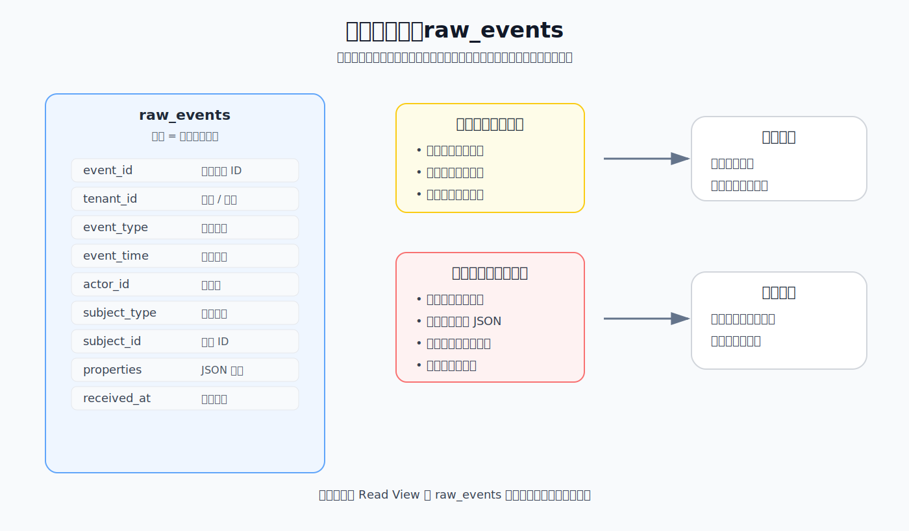
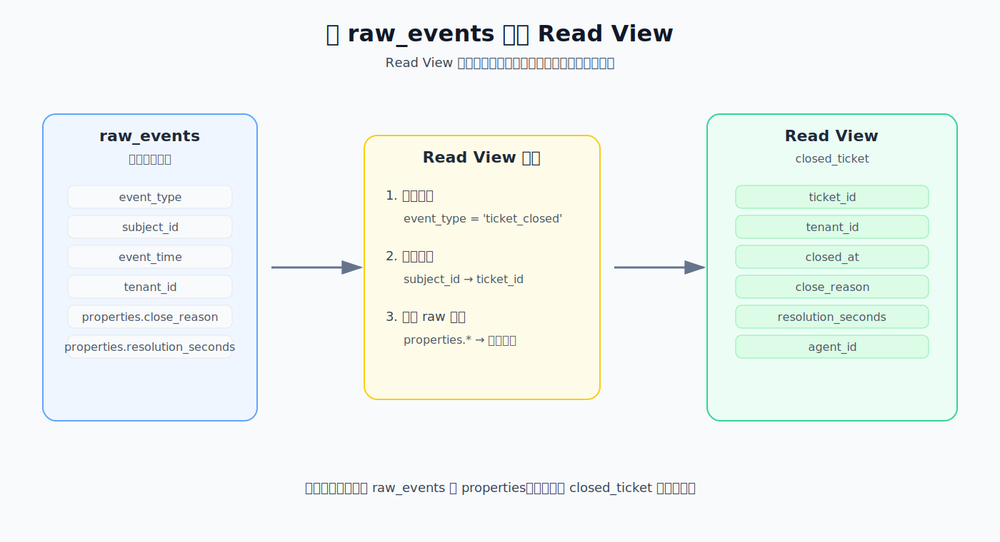
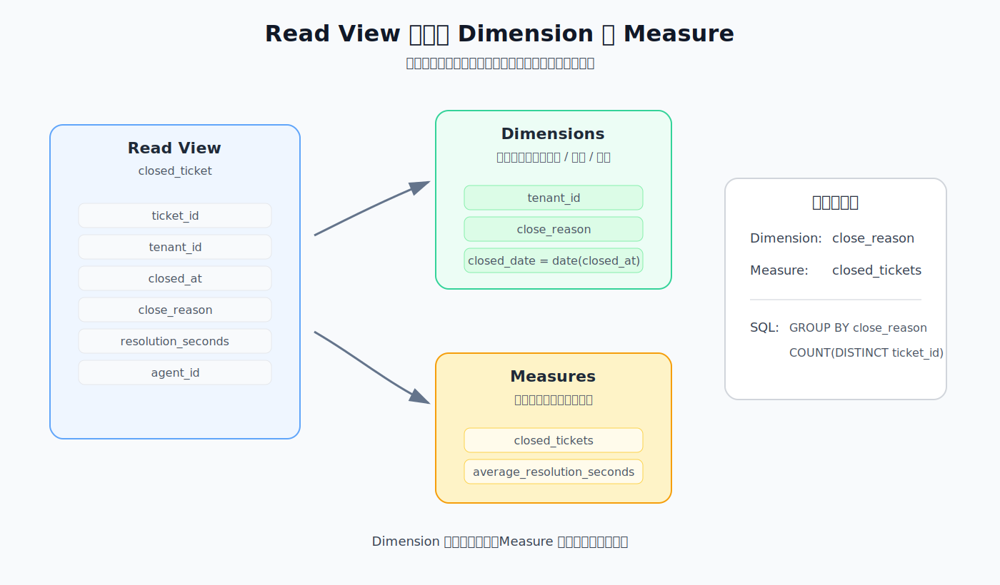
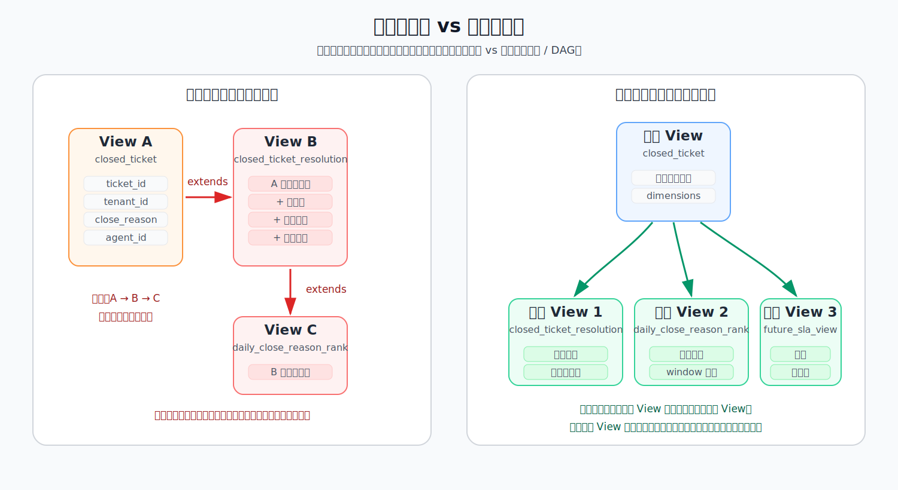
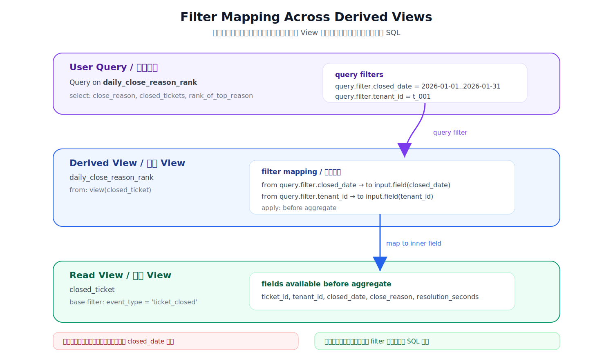
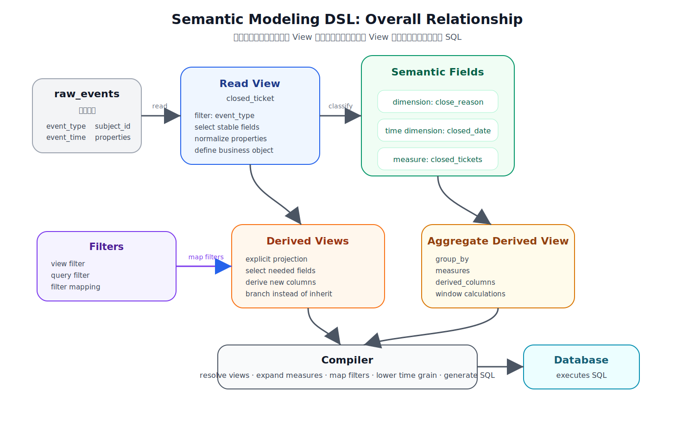

# 设计一门 Semantic Modeling DSL

很多语义层（semantic layer）的设计，默认数据已经被整理成了干净的明细表：订单表、工单表、支付表、用户表。此时再去定义字段、指标和查询入口，问题相对清楚。

但如果一开始只有一张原始事件表呢？

这张表像业务系统的流水账，记录了各种各样发生过的事情：订单创建、支付成功、工单关闭、退款申请。它保存了事实，却不是一个适合直接分析的接口。

这篇文章尝试从这个更底层的问题出发：如何从一张原始事件表，一步步推导出一套可以稳定分析的 DSL 建模方式。

> 核心问题不是“怎么给一张表起更多字段名”，而是：怎么把原始事实逐步整理成稳定的业务对象，并让后续分析不再反复理解底层事件结构。

## 1. 从原始事件表开始

我们先从一张“记录所有业务动作的流水表”开始，而不是从数仓里已经整理好的明细表开始。

所谓“原始事件表”，可以先理解成系统流水账。

业务系统里发生了一件事，就往这张表里写一行。它不是为某一个报表或分析主题专门设计的表，而是一个更底层、更通用的事件记录入口。

例如我们可以定义一张通用的原始事件表，名字叫 `raw_events`。它的字段可以是：

| 字段 | 含义 |
| --- | --- |
| `event_id` | 事件唯一 ID |
| `tenant_id` | 租户或组织 ID |
| `event_type` | 事件类型，例如 `order_created`、`ticket_closed`、`payment_succeeded` |
| `event_time` | 事件发生时间 |
| `actor_id` | 触发事件的人或系统 |
| `subject_type` | 被操作对象类型，例如 `order`、`ticket`、`payment` |
| `subject_id` | 被操作对象 ID |
| `properties` | 半结构化事件属性，例如 JSON |
| `received_at` | 系统接收到事件的时间 |

下面这张图展示了 `raw_events` 的位置：它是所有建模的物理输入，但不是我们希望长期暴露给分析用户的接口。



这张表看起来很通用，但也正因为通用，它并不天然适合分析。

例如同一张 `raw_events` 里可能同时出现 `order_created`、`order_paid`、`ticket_opened`、`ticket_closed`、`payment_succeeded`、`refund_requested` 等不同类型的事件。

它适合作为系统事实的原始记录：业务系统里发生过什么，都可以先落到这里。但如果把它直接交给分析用户，很多隐含规则就会暴露出来。

| 问题 | 具体表现 |
| --- | --- |
| 事件类型混在一起 | 用户必须先知道应该过滤哪个 `event_type` |
| 字段语义不稳定 | 同一个 `subject_id` 在不同事件类型下可能代表订单、工单或支付单 |
| 业务字段藏得深 | 关闭原因、支付渠道、退款原因等信息可能都在 `properties` 里 |
| 时间语义不唯一 | `event_time`、`received_at` 和真正的业务时间可能不是同一个概念 |
| 行语义不等于分析对象 | 一行只是“发生了一件事”，不一定等于一个订单、工单或用户 |
| 指标口径不明确 | 指标需要过滤、去重、取有效事件，不能直接从 raw 字段稳定推出 |

以“客服工单关闭情况”为例，直接查 `raw_events` 时，用户必须提前知道这些规则：

- 只看 `event_type = 'ticket_closed'` 的事件；
- 工单 ID 来自 `subject_id`；
- 关闭原因来自 `properties.close_reason`；
- 关闭耗时来自 `properties.resolution_seconds`；
- 关闭时间应该使用 `event_time`。

这些规则如果散落在每一次查询里，分析结果很难长期保持一致。

这说明原始事件表更适合作为物理输入，而不应该直接成为下游长期依赖的分析接口。

我们需要在原始事件表之上，定义一个更稳定的建模层。

> 这层建模的目标，是把“我知道 raw 表里该怎么查”变成“我有一个可以被复用的业务对象”。

## 2. Read View

在这门 DSL 里，我们先引入第一个建模概念：`Read View`。

`Read View` 可以理解成一种“读法”：它从原始流水账里整理出一种稳定的业务对象。

它首先是一个逻辑建模概念，不等同于一张新的物理表；后续是否物化，是执行和优化层的问题。它也不是最终给用户查询的分析入口，而是描述：我们要从原始事件表中，读出哪一类稳定业务对象。

更正式地说，`Read View` 是一个命名的逻辑关系。它声明如何从原始事件表中筛选、抽取、重命名和标准化字段，从而形成一个稳定的业务对象视图。

例如，我们可以从 `raw_events` 中读出“已关闭工单”：

下面这张图展示了这个转换：从通用的 `raw_events` 中，只读出 `ticket_closed` 事件，并整理成 `closed_ticket`。



```yaml
views:
  closed_ticket:
    type: read_view
    from: raw_events
    where: event_type = 'ticket_closed'
    fields:
      ticket_id: col(subject_id)
      tenant_id: col(tenant_id)
      closed_at: col(event_time)
      close_reason: json(properties, 'close_reason')
      resolution_seconds: cast(json(properties, 'resolution_seconds'), number)
      agent_id: json(properties, 'agent_id')
```

这个 `Read View` 的作用，是把一段通用事件流收敛成一个稳定的业务读模型。

| 动作 | 在这个例子中的含义 |
| --- | --- |
| 筛选事件 | 只读取 `ticket_closed` 事件 |
| 稳定字段 | 把通用的 `subject_id` 命名为业务上的 `ticket_id` |
| 隐藏 raw 细节 | 从 `properties` 提取关闭原因、关闭耗时、处理人 |

这段 DSL 最终可以编译成类似这样的 SQL：

```sql
SELECT
  subject_id AS ticket_id,
  tenant_id,
  event_time AS closed_at,
  JSON_VALUE(properties, '$.close_reason') AS close_reason,
  CAST(JSON_VALUE(properties, '$.resolution_seconds') AS DOUBLE) AS resolution_seconds,
  JSON_VALUE(properties, '$.agent_id') AS agent_id
FROM raw_events
WHERE event_type = 'ticket_closed';
```

这一步的重点不是聚合，而是把原始事件表中的通用字段整理成稳定字段。也就是说，`Read View` 先解决“从 raw 表里读出什么业务对象”的问题。

从这一刻开始，下游不再需要理解 `raw_events` 的物理结构，也不需要反复解析 `properties`。它们可以直接基于 `closed_ticket` 继续建模。

> 为了让例子聚焦在概念本身，这里先假定一个工单只会产生一条有效的 `ticket_closed` 事件。真实系统里如果存在重复事件、撤回、重新关闭等情况，`Read View` 还需要继续声明去重规则和有效性规则。

现在我们有了一个更清楚的分析对象：`closed_ticket`。它还不是完整的语义模型，但已经比原始表稳定很多。

它回答了第一个问题：我要从原始事件表里读出什么业务对象？

接下来，我们继续追问一个更具体的问题：这个业务对象里的字段，在分析时分别用来做什么？

从使用方式看，`Read View` 里的字段会自然分成两类：一类字段用来描述业务对象，另一类定义如何在一组业务对象上计算指标。前者就是 `dimension`，后者就是 `measure`。

下面这张图展示了同一个 `Read View` 如何继续拆出两类语义字段。



这一步很重要：`dimension` 和 `measure` 不是为了套用某种 BI 术语才出现，而是因为同一批字段在分析中承担了不同职责。

## 3. 从 Read View 推导出 Dimension

有了 `closed_ticket` 之后，我们会发现里面有些字段是用来描述业务对象的。

例如 `close_reason`、`tenant_id`、`closed_at`。

其中，`closed_at` 是工单关闭的具体时间点。分析时我们通常会从它派生出 `closed_date`，用于按天、按周、按月分组。

这些字段本身不是指标。它们更像“标签”或“属性”，会在分析中承担不同用途。

| 用途 | 例子 |
| --- | --- |
| 过滤 | 只看某个 `tenant_id` 下的工单 |
| 分组 | 按 `close_reason` 统计关闭工单 |
| 展示 | 在结果里显示关闭原因或租户 |
| 时间粒度 | 从 `closed_at` 派生 `closed_date`，再按天、周、月汇总 |

这类字段就是 `dimension`。

> `dimension` 的作用，是让我们能够从不同角度观察同一类业务对象。

### 时间字段为什么需要单独标记

大部分 dimension 只是描述对象的属性，例如 `close_reason` 或 `tenant_id`。但时间字段会多出一层语义。

`closed_at` 表示工单关闭的具体时间点。分析时，我们通常不会直接按精确到秒的时间分组，而是希望按天、按周或按月观察趋势。这时，时间字段需要回答三个额外问题：

| 问题 | 例子 |
| --- | --- |
| 用哪个时间 | 关闭时间、创建时间、接收时间不是同一个概念 |
| 按什么粒度 | day / week / month 的分桶规则要稳定 |
| 用哪个时区 | 不同租户的业务日期边界可能不同 |

所以我们把这类 dimension 标记成 `time dimension`。它仍然是 dimension，只是比普通属性字段多了时间粒度和时区解释方式。

```yaml
dimensions:
  closed_date:
    type: time_dimension
    expr: field(closed_at)
    timezone: context.tenant_timezone
    granularities: [day, week, month]
```

普通 dimension 和 time dimension 的区别可以这样理解：

| 类型 | 例子 | 主要作用 |
| --- | --- | --- |
| 普通 dimension | `close_reason` | 按属性过滤、分组、展示 |
| time dimension | `closed_date` | 按时间过滤、分桶、做趋势分析 |

当用户选择 `closed_date by week` 时，compiler 不应该把它当成普通字段透传，而应该生成对应数据库的时间分桶 SQL：

```sql
DATE_TRUNC('week', TIMEZONE(context.tenant_timezone, closed_at)) AS closed_week
```

这里的 `TIMEZONE(...)` 是伪 SQL，用来表达时区语义。真实系统需要根据底层数据库方言生成对应函数，例如不同数据库的 timezone 转换、week 起始日和 `date_trunc` 写法都可能不同。

所以我们可以把 `Read View` 里的部分字段声明成 dimensions。把普通 dimension 和 time dimension 放回同一个 View 后，声明会长这样：

```yaml
views:
  closed_ticket:
    type: read_view
    from: raw_events
    where: event_type = 'ticket_closed'

    dimensions:
      close_reason:
        type: string
        expr: field(close_reason)

      tenant_id:
        type: string
        expr: field(tenant_id)

      closed_date:
        type: time_dimension
        expr: field(closed_at)
        timezone: context.tenant_timezone
        granularities: [day, week, month]
```

这样，`dimension` 就不是凭空发明出来的概念，而是从 `Read View` 中自然推导出来的：`Read View` 读出业务对象，`dimension` 描述这个业务对象。

## 4. 从 Read View 推导出 Measure

接下来，我们想问一些聚合问题：

- 一共有多少关闭工单？
- 每个关闭原因下有多少工单？
- 每周关闭了多少工单？
- 平均关闭耗时是多少？

这些问题不能靠看某一行直接回答。它们需要把很多行放在一起计算。

例如，`closed_tickets = count_distinct(ticket_id)`。

它不是 `closed_ticket` 每一行自带的普通字段，而是把很多工单放在一起之后算出来的结果。

这类“需要在查询上下文里聚合计算出来的指标”就是 `measure`。

> `measure` 的作用，是把一组业务对象汇总成一个可比较、可追踪的数字。

同一个 `measure` 会随着查询上下文变化。

| 查询方式 | `closed_tickets` 的含义 |
| --- | --- |
| 不分组 | 所有关闭工单数 |
| 按 `close_reason` 分组 | 每种关闭原因下的关闭工单数 |
| 按 `closed_date` 分组 | 每天、每周或每月的关闭工单数 |

```yaml
views:
  closed_ticket:
    type: read_view
    from: raw_events
    where: event_type = 'ticket_closed'

    dimensions:
      close_reason:
        type: string
        expr: field(close_reason)

      closed_date:
        type: time_dimension
        expr: field(closed_at)
        timezone: context.tenant_timezone
        granularities: [day, week, month]

    measures:
      closed_tickets:
        type: count_distinct
        expr: field(ticket_id)

      average_resolution_seconds:
        type: avg
        expr: field(resolution_seconds)
```

### 一个查询如何展开成 SQL

如果用户想看“每种关闭原因下有多少关闭工单”，这组 `dimension + measure` 可以编译成：

```sql
WITH closed_ticket AS (
  SELECT
    subject_id AS ticket_id,
    tenant_id,
    event_time AS closed_at,
    JSON_VALUE(properties, '$.close_reason') AS close_reason,
    CAST(JSON_VALUE(properties, '$.resolution_seconds') AS DOUBLE) AS resolution_seconds,
    JSON_VALUE(properties, '$.agent_id') AS agent_id
  FROM raw_events
  WHERE event_type = 'ticket_closed'
)
SELECT
  close_reason,
  COUNT(DISTINCT ticket_id) AS closed_tickets
FROM closed_ticket
GROUP BY close_reason;
```

这里可以看到 `dimension` 和 `measure` 的分工：

| DSL 概念 | SQL 里的作用 |
| --- | --- |
| `close_reason` dimension | 进入 `SELECT` 和 `GROUP BY` |
| `closed_tickets` measure | 展开成 `COUNT(DISTINCT ticket_id)` |

如果查询上下文变成“按日期看趋势”，同一个 `closed_tickets` 会生成另一种聚合 SQL：

```sql
WITH closed_ticket AS (
  SELECT
    subject_id AS ticket_id,
    tenant_id,
    event_time AS closed_at,
    DATE(event_time) AS closed_date,
    JSON_VALUE(properties, '$.close_reason') AS close_reason,
    CAST(JSON_VALUE(properties, '$.resolution_seconds') AS DOUBLE) AS resolution_seconds,
    JSON_VALUE(properties, '$.agent_id') AS agent_id
  FROM raw_events
  WHERE event_type = 'ticket_closed'
)
SELECT
  closed_date,
  COUNT(DISTINCT ticket_id) AS closed_tickets
FROM closed_ticket
GROUP BY closed_date
ORDER BY closed_date;
```

这说明 `measure` 的定义是稳定的，但它生成的 SQL 会根据查询里选择的 `dimension` 发生变化。这里的 `closed_date` 来自上游 View 中声明的 time dimension，不是 `raw_events` 的物理字段。

所以 `measure` 也是从 `Read View` 里自然推导出来的。

`Read View` 先把原始事件整理成一个可分析的业务对象；`dimension` 描述这个对象；`measure` 则用于回答关于一组对象的聚合问题。

把 `dimension` 和 `measure` 放在一起，就可以表达一个最简单的分析问题。

例如，“我想看每种关闭原因下有多少关闭工单”。

这个问题可以拆成一个 `dimension` 和一个 `measure`：按 `close_reason` 分组，然后计算 `closed_tickets`。

到这里，我们得到三个核心概念。

`Read View` 负责从原始事件表中读出业务对象；`dimension` 负责描述这个对象；`measure` 负责在查询上下文中计算关于这些对象集合的指标。

这三个概念不是从抽象定义开始的，而是从一张原始事件表的建模过程里一步步长出来的。

## 5. 从一个 View 派生出另一个 View

到目前为止，我们已经从 `raw_events` 读出了 `closed_ticket`，并在它之上定义了 `dimension` 和 `measure`。

但真实建模不会只停留在一个 View 上。随着分析场景变多，我们经常需要在已有 View 的基础上，再整理出一个更窄、更明确的业务视图。

很多建模系统都会提供某种“复用已有定义”的能力。比如 Cube 明确提供了 [`extends`](https://cube.dev/docs/product/data-modeling/reference/cube#extends)，让一个 cube 复用另一个 cube 已经声明的成员。这类机制在复用少量公共定义时很方便。

但如果把它作为 View 建模的主路径，就容易把模型做成一条线性链路：`A -> B -> C`。每一层都携带上游越来越多的字段和历史决策，下游 View 的输出边界会变得不清楚。

这里要讨论的不是某个产品设计对错，而是一个更基础的建模问题：如果下游 View 默认继承上游 View 的全部字段和语义成员，长期会发生什么？

下面这张图展示了两种建模方式的差异：左边是 `extends` 式继承，右边是显式派生。

这里的差异不只是字段是否复制，更是建模结构不同。继承容易形成 `A -> B -> C` 的线性条形链路；派生则允许一个稳定上游 View 发散出多个下游 View，形成更适合扩展分析场景的树形结构。

更深层的问题是，继承容易把建模关系做成一条不断加厚的链；而派生允许同一个稳定 View 向多个方向发散，每个下游 View 都为自己的分析目的重新声明输出边界。



继承全部字段意味着下游 View 会默认获得上游所有细节。短期看省事，长期看会带来几个问题：

| 问题 | 为什么会影响建模 |
| --- | --- |
| 字段边界不清楚 | 下游 View 不清楚哪些字段是自己真正承诺暴露的字段 |
| 上游变更容易扩散 | 上游新增或修改字段，可能无意中影响下游使用者 |
| 下游依赖变隐式 | 使用者可能依赖了某个“顺手继承下来”的字段，而不是 View 明确声明的字段 |
| 业务语义不够收敛 | 一个面向特定分析场景的 View，仍然暴露了很多不相关字段 |

所以我们更倾向于把派生 View 设计成显式投影，而不是继承。这里的“投影”可以先简单理解成：明确选择这个 View 最终要输出哪些列。

也就是说，下游 View 可以基于上游 View，但必须明确选择自己要读哪些字段、如何命名、是否增加新的派生字段，必要时也可以增加自己的过滤条件。

```yaml
views:
  closed_ticket_resolution:
    type: derived_view
    from: view(closed_ticket)
    fields:
      ticket_id: field(ticket_id)
      tenant_id: field(tenant_id)
      closed_date: field(closed_date)
      close_reason: field(close_reason)
      resolution_seconds: field(resolution_seconds)
      is_fast_resolution: field(resolution_seconds) <= 3600
```

这个派生 View 可以编译成类似这样的 SQL：

```sql
WITH closed_ticket AS (
  SELECT
    subject_id AS ticket_id,
    tenant_id,
    DATE(event_time) AS closed_date,
    event_time AS closed_at,
    JSON_VALUE(properties, '$.close_reason') AS close_reason,
    CAST(JSON_VALUE(properties, '$.resolution_seconds') AS DOUBLE) AS resolution_seconds,
    JSON_VALUE(properties, '$.agent_id') AS agent_id
  FROM raw_events
  WHERE event_type = 'ticket_closed'
)
SELECT
  ticket_id,
  tenant_id,
  closed_date,
  close_reason,
  resolution_seconds,
  resolution_seconds <= 3600 AS is_fast_resolution
FROM closed_ticket;
```

这里的 `closed_date` 是从上游 View 的 time dimension 中选择出来的字段，而不是直接从原始事件表读取的列。这个 SQL 也体现了派生 View 的边界：下游 View 只输出自己声明过的字段。

这个例子里，`closed_ticket_resolution` 并没有继承 `closed_ticket` 的全部字段。它只选择了当前分析需要的字段，并额外派生出 `is_fast_resolution`。

同样，`measure` 也不应该被自动继承。派生 View 如果需要指标，应该重新声明自己要暴露的 measures，或者显式引用上游可用的语义字段。

这样一来，`closed_ticket_resolution` 本身就形成了新的输出契约：

| 输出字段 | 来源 |
| --- | --- |
| `ticket_id` | 来自上游 `closed_ticket.ticket_id` |
| `tenant_id` | 来自上游 `closed_ticket.tenant_id` |
| `closed_date` | 来自上游 `closed_ticket.closed_date` |
| `close_reason` | 来自上游 `closed_ticket.close_reason` |
| `resolution_seconds` | 来自上游 `closed_ticket.resolution_seconds` |
| `is_fast_resolution` | 基于 `resolution_seconds` 派生出来的新字段 |

这更接近 Looker derived table 的思路：不是把一个对象的所有字段无条件继承下来，而是基于一个已有查询或已有 View，生成一个新的、命名的、可复用的关系。

区别在于，我们这里先把它放在 DSL 的建模语义里：派生 View 仍然是逻辑建模节点，最终可以由编译器决定是 inline、生成 CTE，还是在未来物化。

> 派生 View 的核心不是复用全部字段，而是复用上游已经整理好的业务语义，并显式声明新的输出边界。

有了这个约束，多个 View 就可以自然形成一个发散式建模 DAG：

```text
raw_events
  -> closed_ticket
      -> closed_ticket_resolution
      -> daily_close_reason_rank
      -> future_sla_view
```

这个 DAG 不是为了模拟面向对象里的继承关系，而是为了描述数据建模里的依赖关系：每个 View 都有明确输入，也有明确输出。下游只依赖上游公开出来、并被自己显式选择的字段。

这也是为什么我们不把 `extends` 作为核心模型。对语义建模来说，更重要的不是“继承了什么”，而是“这个 View 最终承诺输出什么”。

## 6. 在聚合结果上继续派生字段

有时派生 View 不只是选择字段，还需要继续加工字段。

例如，我们想知道每个租户每天最常见的关闭原因，可以先按 `tenant_id + closed_date + close_reason` 聚合，再用窗口函数给关闭原因排名。

这类 View 可以理解成 aggregate derived view：它先基于上游 View 聚合出一个中间结果，再在这个结果上继续派生列。

DSL 可以表达成：

```yaml
views:
  daily_close_reason_rank:
    type: derived_view
    from: view(closed_ticket)
    group_by:
      - tenant_id
      - closed_date
      - close_reason
    measures:
      closed_tickets:
        type: count_distinct
        expr: field(ticket_id)
    derived_columns:
      rank_of_top_reason:
        sql: ROW_NUMBER() OVER (
          PARTITION BY tenant_id, closed_date
          ORDER BY closed_tickets DESC
        )
```

这里用 `sql` 展示的是表达能力，不代表系统会把任意 SQL 无治理透传到底层数据库。实际实现仍然需要做字段引用校验、方言适配和函数白名单。

这里的 `closed_tickets` 已经不是 measure 定义本身，而是前一步聚合结果中的字段。

它可以被编译成两层 SQL：先聚合，再在聚合结果上计算窗口列。

```sql
WITH closed_ticket AS (
  SELECT
    subject_id AS ticket_id,
    tenant_id,
    DATE(event_time) AS closed_date,
    JSON_VALUE(properties, '$.close_reason') AS close_reason
  FROM raw_events
  WHERE event_type = 'ticket_closed'
),
close_reason_summary AS (
  SELECT
    tenant_id,
    closed_date,
    close_reason,
    COUNT(DISTINCT ticket_id) AS closed_tickets
  FROM closed_ticket
  GROUP BY
    tenant_id,
    closed_date,
    close_reason
)
SELECT
  tenant_id,
  closed_date,
  close_reason,
  closed_tickets,
  ROW_NUMBER() OVER (
    PARTITION BY tenant_id, closed_date
    ORDER BY closed_tickets DESC
  ) AS rank_of_top_reason
FROM close_reason_summary;
```

这类 `derived_columns` 和 `measure` 不一样。`measure` 描述的是如何在查询上下文里聚合出一个指标；`derived_column` 则是派生 View 输出里的一个稳定字段。

它可能依赖上游已经形成的关系，甚至可能依赖聚合结果，所以它应该出现在派生 View 的加工阶段，而不是混进最底层的 `Read View`。

到这里，View DAG 就不只是概念图，而是可以逐层编译成 SQL 的建模链路：

```text
raw_events
  -> closed_ticket
      -> closed_ticket_resolution
      -> daily_close_reason_rank
```

每一层都有明确输入、明确输出，也能解释自己最终会变成什么 SQL。

## 7. Filter 与 filter mapping：把约束放到正确的层级

随着 View 层级不断加深，我们还会遇到一个问题：用户传入的过滤条件，应该落在哪一层 SQL 里？

最简单的过滤在 `Read View` 里已经出现过：

```yaml
where: event_type = 'ticket_closed'
```

这个条件是 View 定义的一部分，可以称为 `view filter`。它不是用户临时选择的条件，而是 `closed_ticket` 这个业务对象成立的前提：只有 `ticket_closed` 事件，才会被读成关闭工单。

但用户查询时也会传入外部约束，例如只看某个租户、某个日期范围、某类关闭原因。这类约束可以称为 `query filter`。它们不应该全部写死在 View 里，也不能简单地都拼到最终 SQL 的最外层。

这里需要把三个概念分开：

| 概念 | 解决的问题 | 是否可以作为输出字段 |
| --- | --- | --- |
| `dimension` | 这个 View 可以从哪些角度被观察、分组或展示 | 可以 |
| `filter` | 这个 View 对外接受哪些查询约束 | 否 |
| `filter mapping` | 外层 query filter 应该映射到哪一层的哪个字段或表达式 | 否 |

这个区分不是为了增加术语，而是为了避免同名概念被混用。

例如 `closed_date` 可以是一个 dimension：

```yaml
dimensions:
  closed_date:
    type: time_dimension
    expr: field(closed_at)
```

它也可以是一个 filter：

```yaml
filters:
  closed_date:
    type: date_range
```

如果用户写了 `closed_date`，系统不能只靠名字猜：用户到底是想把 `closed_date` 放进查询结果里，还是想用 `closed_date` 限制数据范围？

所以 DSL 里应该有清晰的引用空间：

```text
dimension.closed_date    -> 输出字段 / 分组字段
query.filter.closed_date -> 外部查询约束
```

### 7.1 为什么不能把 filter 都拼到最外层

对于单层 View，filter 位置通常比较直观。用户传入 `closed_date between ...`，编译器可以把它翻译成对 `closed_ticket.closed_date` 的过滤。

但派生 View 会经过投影、聚合、重命名和窗口计算。到了最外层，某些 filter 需要的字段可能已经不存在了。

例如 `daily_close_reason_rank` 基于 `closed_ticket` 聚合出每天每种关闭原因的排名：

```text
raw_events
  -> closed_ticket
      -> daily_close_reason_rank
```

如果最外层只输出：

```text
close_reason
closed_tickets
rank_of_top_reason
```

这时用户仍然可能希望按 `closed_date` 过滤。但 `closed_date` 只存在于内层 `closed_ticket` 或中间聚合层里，不一定存在于最终输出层。

错误做法是把所有 filter 都拼到最外层：

```sql
WITH closed_ticket AS (...),
close_reason_summary AS (
  SELECT
    close_reason,
    COUNT(DISTINCT ticket_id) AS closed_tickets
  FROM closed_ticket
  GROUP BY close_reason
)
SELECT
  close_reason,
  closed_tickets
FROM close_reason_summary
WHERE closed_date BETWEEN DATE '2026-01-01' AND DATE '2026-01-31';
```

这个 SQL 不成立，因为 `close_reason_summary` 没有 `closed_date` 字段。

另一个极端也不对：把所有 filter 都自动下推到最底层。某些 filter 应该作用在聚合后结果上，例如 `closed_tickets > 100`。如果盲目下推，指标口径会变。

因此，filter 需要显式映射。

| 做法 | 问题 |
| --- | --- |
| 所有 filter 拼到最外层 | 最外层可能没有这个字段，或者过滤发生得太晚 |
| 所有 filter 自动下推 | 可能改变聚合口径，或者把聚合后 filter 错放到明细层 |
| 使用 `filter mapping` | 明确 query filter 从外层查询映射到哪一层、哪个字段 |

### 7.2 filter mapping 描述 filter 的映射路径

下面这张图展示了 `filter mapping` 解决的问题：外层查询传入 filter，中间派生 View 声明映射规则，编译器再把 filter 放到内层正确字段上。



例如我们可以这样声明：

```yaml
views:
  daily_close_reason_rank:
    type: derived_view
    from: view(closed_ticket)

    group_by:
      - tenant_id
      - closed_date
      - close_reason

    measures:
      closed_tickets:
        type: count_distinct
        expr: field(ticket_id)

    filters:
      tenant_id:
        type: string
      closed_date:
        type: date_range

    filter_mappings:
      - from: query.filter.tenant_id
        to: input.field(tenant_id)
        apply: before_aggregate
      - from: query.filter.closed_date
        to: input.field(closed_date)
        apply: before_aggregate
```

这里的 `filter_mappings` 只是一个临时示例名，不代表最终 DSL API 已经确定。真正需要固定的是它的语义：`filters` 声明 `daily_close_reason_rank` 对外接受哪些 query filter；过滤映射规则声明这些 query filter 最终映射到哪里。

| 外层约束 | 映射目标 | 作用层级 |
| --- | --- | --- |
| `query.filter.tenant_id` | `input.field(tenant_id)` | 聚合前 |
| `query.filter.closed_date` | `input.field(closed_date)` | 聚合前 |

这样用户在外层传入 `closed_date` filter 时，系统知道它应该映射到输入 View 的 `closed_date` 字段，而不是误认为用户一定要把 `closed_date` 作为输出 dimension 选出来。

### 7.3 对应 SQL 会发生什么

如果用户查询：

```text
query.filter.tenant_id = 't_001'
query.filter.closed_date between '2026-01-01' and '2026-01-31'
```

编译器可以把 filter 放到聚合之前：

```sql
WITH closed_ticket AS (
  SELECT
    subject_id AS ticket_id,
    tenant_id,
    DATE(event_time) AS closed_date,
    JSON_VALUE(properties, '$.close_reason') AS close_reason
  FROM raw_events
  WHERE event_type = 'ticket_closed'
    AND tenant_id = 't_001'
    AND DATE(event_time) BETWEEN DATE '2026-01-01' AND DATE '2026-01-31'
),
close_reason_summary AS (
  SELECT
    tenant_id,
    closed_date,
    close_reason,
    COUNT(DISTINCT ticket_id) AS closed_tickets
  FROM closed_ticket
  GROUP BY
    tenant_id,
    closed_date,
    close_reason
)
SELECT
  tenant_id,
  closed_date,
  close_reason,
  closed_tickets,
  ROW_NUMBER() OVER (
    PARTITION BY tenant_id, closed_date
    ORDER BY closed_tickets DESC
  ) AS rank_of_top_reason
FROM close_reason_summary;
```

这不是一个纯 SQL 优化问题，而是语义映射问题。只有 DSL 明确知道 `query.filter.closed_date` 应该映射到 `input.field(closed_date)`，编译器才能安全地把它放到正确层级。

### 7.4 为什么不直接把 dimension 当 filter

一个常见问题是：既然 `dimension` 本来就可以过滤，为什么还要单独声明 `filter`？

可以用两个具体场景理解。

第一个场景是租户隔离。

`tenant_id` 很可能需要参与所有查询过滤，但它不一定应该出现在分析结果里。用户可以通过它限制数据范围，但不应该随便把它选出来展示或分组。

如果只用 dimension 表达，它会变成一个“可输出字段”：

```yaml
dimensions:
  tenant_id:
    type: string
    expr: field(tenant_id)
```

这会把权限字段暴露成普通分析字段。更合理的表达是：它是一个 filter 入口，映射到内部字段。

```yaml
filters:
  tenant:
    type: string
    default: context.tenant_id

filter_mappings:
  - from: query.filter.tenant
    to: input.field(tenant_id)
    apply: before_aggregate
```

第二个场景是时间范围。

用户查询时通常关心的是“时间范围”，例如：

```text
closed_date between '2026-01-01' and '2026-01-31'
```

但这个 filter 不一定等于一个输出字段。它可能映射到一个表达式：

```text
DATE(event_time)
```

也可能映射到一个上游 View 已经整理好的字段：

```text
input.field(closed_date)
```

这说明 `filter` 和 `dimension` 可能同名，也可能映射到同一个底层字段，但它们表达的是两种不同意图：

| 用户意图 | 应该使用 |
| --- | --- |
| “我想按关闭原因分组看结果” | `dimension.close_reason` |
| “我想按关闭日期展示趋势” | `dimension.closed_date` |
| “我只想看最近 30 天的数据” | `query.filter.date_range` |
| “系统必须限制在当前租户” | `query.filter.tenant` |

同一个底层字段可以同时支持 dimension 和 filter，但它们应该有不同的引用空间：

```text
dimension.closed_date  -> 作为输出、分组或排序字段
query.filter.date_range -> 作为查询约束入口，映射到 closed_date 或其他表达式
```

所以，`filter` 不是 `dimension` 的别名。`dimension` 负责定义可观察的字段；`filter` 负责定义外部查询可以施加的约束；`filter mapping` 负责说明这个约束最终落到哪里。这里先使用 `filter mapping` 这个中性说法，最终 DSL 名称可以后续再定。

## 8. 总结：从原始事实到稳定分析接口

文章开头我们问了一个问题：如果一开始只有一张原始事件表，怎么一步步把它变成可以稳定分析的东西？

现在答案已经比较清楚了。

我们没有直接把 `raw_events` 暴露给分析用户，也没有要求每次查询都重新理解 `event_type`、`subject_id`、`properties` 和各种时间字段。相反，我们把这些隐含规则逐层沉淀下来。

下面这张图总结了目前这套 DSL 的核心关系。



图里的 compiler 不执行查询。它只把 DSL 编译成受治理的 SQL；真正的扫描、聚合、排序和执行仍然交给底层数据库。

第一层是 `Read View`：它把原始事件表中的一类事件，整理成一个稳定的业务对象。

第二层是 `dimension` 和 `measure`：前者描述这个对象，后者在查询上下文中计算指标。时间字段则作为特殊的 `time dimension`，额外声明粒度、时区和时间分桶语义。

第三层是 `derived View`：它不是继承上游全部字段，而是从稳定 View 中显式选择、重命名和继续加工字段，形成新的建模边界。

第四层是 `filter mapping`：当 View 层级变深后，外层查询条件不能简单拼到最外层 SQL，也不能盲目下推。它需要被显式映射到正确的 View 层级和字段。

最后，所有这些 DSL 对象都会被 compiler 翻译成 SQL，交给底层数据库执行。

可以把这些概念理解成几条边界：

| 层次 | 负责什么 | 不负责什么 |
| --- | --- | --- |
| `raw_events` | 保存系统事实的原始记录 | 不直接作为长期分析接口 |
| `Read View` | 从原始事件里读出稳定业务对象 | 不负责聚合指标 |
| `dimension / time dimension` | 描述业务对象，并提供分组、过滤、时间分桶能力 | 不负责计算聚合结果 |
| `measure` | 在查询上下文中计算聚合指标 | 不是普通行级字段 |
| `derived View` | 显式选择和加工上游 View，形成新的输出契约 | 不自动继承上游全部字段 |
| `aggregate derived View` | 在聚合结果上继续派生字段，例如排名、分层、窗口计算 | 不把窗口计算混进底层 Read View |
| `filter mapping` | 把外层 query filter 映射到正确的 View 层级和字段 | 不靠字段同名猜测，也不默认全部下推 |
| compiler | 解析 DSL、展开 measure、映射 filter、降低时间粒度并生成 SQL | 不替代底层数据库执行引擎 |

这篇文章里我们刻意没有展开 join、source registry、权限系统、物化调度、完整 query API，以及 `context.*` 这类动态变量的定义和解析规则。原因是这些问题都可以继续往上叠，但它们不应该打乱第一层建模主干。动态变量会在后续设计中单独展开。

第一阶段真正要确认的是这条链路是否成立：

```text
raw event table
  -> Read View
  -> dimension / time dimension / measure
  -> derived View
  -> filter mapping
  -> generated SQL
```

也就是说，这门 DSL 的核心目标不是替代数据库，而是把原始事件里的隐含业务规则，变成可命名、可复用、可验证、可编译的建模对象。

我们从一张通用的业务流水表开始，最终得到的不是另一张更复杂的表，而是一组稳定的分析接口。

